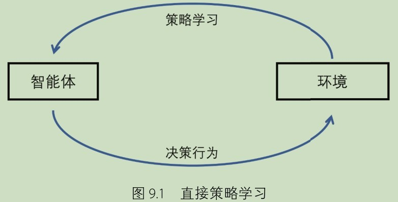

# 深度强化学习

## 一、基本概念

### 重要的关系

1. 智能体与环境
   
   * 智能体：学习到一个最优策略使得期望回报最大化
   
   * 环境：奖励函数，状态转移概率
     

2. 探索与利用
   
   * 贪心
   * $\epsilon$-贪心
   * 置信上界算法
     + $A_{t} = \underset {a}{argmax} [Q_{t}+c\sqrt{\ln{t} \over N_{t}(a)}]$
       - 行为值函数
       - 访问次数
       - 时间

### 马尔可夫决策过程

* 马尔可夫性
  + 未来状态的条件概率分布仅依赖于当前状态，与之前的状态无关
* $<S, A, P, R, \gamma>$
  + 状态集合
  + 动作集合
  + 状态转移矩阵
  + 奖励函数
  + 折扣因子

### 贝尔曼方程

* 贝尔曼期望方程
  + $V_{\pi}(s) = \underset {a} {\sum} \pi(a|s) \underset {s', r} {\sum} P_{s,s'}^{a} [r + \gamma V_{\pi}(s')]$    策略迭代
  + $V_{\pi}(s) = \underset {a \in A} {\sum} \pi(a|s)Q_{\pi}(s,a)$
  + $Q_{\pi}(s,a) = R_{s}^{a} + \gamma \underset {s'} {\sum} P_{s,s'}^{a}V_{\pi}(s')$
* 贝尔曼最优方程
  + $V^*(s) = \underset {a} {\max} \underset {r,s'} {\sum} P(r,s'|s,a)(r+\gamma V(s')$    值迭代

### 1. 动态规划

* 环境已知
  + 奖励函数
  + 状态转移概率
* 策略迭代
  + 策略评估
    - 贝尔曼期望方程
  + 策略改进
    - 状态值函数（环境已知）
      
* 值迭代
  + 贝尔曼最优方程
    

### 2. 蒙特卡罗

* 环境未知
* 回合更新
* 广义策略迭代
  + 策略评估
    - 平均累计回报（大量采样，无限逼近）
  + 策略改进
    - 行为值函数
      

### 3. 时序差分

* 环境未知
* 每步更新
* 广义策略迭代
  + 策略评估
    - 后继值函数
  + 策略改进
    - 行为值函数
* 在线Sarsa
  + 采样和更新同一个策略
    
* 离线Q-Learning
  + 采样和更新不是同一个策略
    

### 4. 蒙特卡罗和时序差分的对比

* 偏差-方差权衡
  + 蒙特卡罗
    - Q值为真实回报--偏差更小
    - 回合更新后才更新--方差更大
  + 时序差分
    - Q值有较大的随机性--偏差更大
    - 采样的每一步都更新--方差更小

## 二、深度强化学习算法分类

* 基于价值的方法
  + 优点：
    - 经历回放--采样效率高
    - 方差小
    - 不易陷入局部最优
  + 缺点：只能处理离散动作空间
  + 常见算法
    - DQN
    - Double DQN
    - Dueling DQN
    - PER DQN
* 基于策略的方法
  + 优点：
    - 能处理连续动作空间
    - 算法收敛快
    - 能学到随机策略
  + 缺点：
    - 方差大
    - 容易陷入局部最优
  + 常见算法
    - PG
* 两种方式的结合
  + 常见算法
    - AC
    - A2C
    - A3C
    - TRPO
    - PPO-Penaty, PPO-Clip
    - DDPG
    - TD3
    - SAC

### 基于价值的方法

* DQN（Deep Q-Networks, 2015）
  + 通过神经网络表示价值函数
  + 优化目标--最小化TD均方误差
  + 两个关键技术
    - 经历回放--减少样本的相关性
    - 目标网络--提高学习的稳定性
       
* Double DQN
  + 减少过拟合--下一个动作的选取和Q值估计使用两个不同的网络
* Dueling DQN
  + 将行为值函数分解为状态值函数和动作优势两部分
* PER DQN
  + 对经验进行优先排序--优先考虑TD误差大的状态转移
  + 破坏了随机采样--使用重要性采样修正权重

### 基于策略的方法

* REINFORCE（1992）
  
  + 通过神经网络表示策略
  
  + 优化目标--最大化期望累计回报
  
  + 思想--鼓励智能体选择高收益的动作
  
  + 缺点--存在较大的方差
  
  + 引入一个基线函数来减小方差--$b(S_{t})$
    
    

* AC（Actor-Critic, 2000）
  
  + 通过神经网络表示价值函数和策略
  
  + 策略网络产生动作，价值网络评估动作
    
    

* A2C
  
  + 增加了并行计算
  + 工作节点负责与环境交互，并上传梯度信息
  + master节点负责收集、更新并同步梯度信息

* A3C
  
  + 工作节点不再需要等待
  + 工作节点负责与环境交互，并上传梯度信息
  + master节点负责更新梯度信息
  + 一致性不再满足--工作节点的梯度信息不再是全局的梯度信息

* TRPO（Trust Region Policy Optimization, 2015）

* PPO-Penalty, PPO-Clip（Proximal Policy Optimization, 2017）

* DDPG（Deep Deterministic Policy Gradient, 2016）
  
  + 解决DQN无法用于连续动作空间的问题--同时建立策略网络和价值网络
  + 与AC的区别--策略网络是确定性策略
  + 确定性策略的探索问题--给输出动作添加噪声
  + 指数平滑更新--更新缓慢且平稳

* TD3（Twin Delayed Deep Deterministic Policy Gradient, 2018）
  
  1. 目标策略平滑--给目标策略的输出动作添加噪声，平滑Q值估计
  
  2. 截断的Double Q-Learning--学习两个Q值网络，每次选择其中最小值进行计算
  
  3. 延迟策略更新--策略网络的更新频率低于Q值网络
  
  

* SAC

## 三、深度强化学习中的挑战

### 样本效率

* 问题：现实世界中智能体与环境交互往往有较大的代价

* 解决方法：提高样本效率
  
  + 提供有用的先验知识
    - 专家示范（模仿学习）
    - 基于模型的学习
  + 更高效的提取信息的方式

### 学习稳定性

* 问题：
  + 巨大的局部方差
  + 单次学习曲线上的非单调增长
  + 多次学习表现之间的巨大差异
* 原因：
  + 数据不满足独立同分布
  + 对价值函数的不稳定的有偏估计

### 灾难性遗忘

* 问题：新的数据需要神经网络改变很多来拟合它，从而忘记了之前训练过程所学习到的内容

### 探索

* 困难：
  + 稀疏的奖励函数
  + 较大的动作空间
  + 不稳定的学习环境
  + 现实世界探索的安全性

### 模拟到现实

* 强化学习的潜在应用领域：机器人控制、自动驾驶汽车、无人机自动控制
* 困难：
  + 安全性和准确性方面的考虑
  + 现实世界训练代价太高
* 解决方法：模拟到现实迁移
* 存在问题：现实鸿沟
  + 动力学上的不准确性
  + 系统响应延迟
  + 观察量延迟
* 解决方法：
  + 域自适应：将源域中训练的模型迁移到新的目标域，要求源域和目标域有公共的特征
  + 零样本迁移：将源域和目标域的差异建模为源域的随机性，不需要在现实世界进行进一步的学习

## 四、模仿学习

### 行为克隆

* 思想：
  
  使用监督学习直接模仿专家示范
  
  $\underset{\theta}{min} \underset{\tilde{a_{i}} \sim \pi(\cdot|s_{i}),(s_{i}, a_{i} \sim D)}{\sum}{||a_{i}-\tilde{a_{i}}||_{2}^{2}}$

* 挑战：
  
  + 协变量漂移：对训练过程没见的样本有较差的泛化表现
  + 复合误差：小的误差随时间积累最终导致不同的状态分布

* 解决方法：
  
  + 数据集聚合（DAgger）
    1. 主动选择策略，在随后过程有更大几率遇到示范样本
    2. 示范数据集在每个时间步聚合新的数据集
    - 缺点：要求不断地与专家交互
  + Variational Dropout
    1. 使用示范数据集预训练
    2. 用一个确定的方差阈值进行Dropout

### 逆向强化学习

* 思想：
  
  1. 使用专家示范推断一个隐藏的奖励函数
  
  2. 使用推断的奖励函数学习一个模仿策略

* 最大熵方法（MaxEnt, 2010）
  
  + 代价函数最小化，$c(s,a)=-R(s,a)$
  + 奖励值差异最大化 $R^{*}=\underset {R} {argmax} \underset {s \in S} {\sum} (Q^{\pi}(s, a_{E})-\underset {a \in A / a_{E}} {max} Q^{\pi}(s, a))$
  + 逆向强化学习目标：$\underset {c} {max} (\underset {\pi} {min} -E_{\pi} [-log \pi (a|s)] + E_{\pi}[c(s,a)]) - E_{\pi_{E}}[c(s,a)]$

* 生成对抗模仿学习（Generative Adversarial Imitation Learning, GAIL, 2016）
  
  + 引入一个对模仿者的状态-动作占用率的度量，使得与示范者的相关特性类似
  + 使用GAN的辨别器给出示范数据的行为值函数估计
  + 辨别器的损失函数为：$Loss=E_{\Tau_{i}}[\nabla_{\omega}\log(D_{\omega}(s,a))]+E_{\Tau_{E}}[\nabla_{\omega}\log(1-D_{\omega}(s,a))]$
    

### 从观察量进行模仿学习

* 思想：
  
  在没有完整可观测的动作的情况下进行模仿学习

* 基于模型的方法
  
  + 逆向动态模型
    
    从状态转移${(S_{t}, S_{t+1})}$到动作$A_{t}$的映射 $A_{t}=M_{\theta}^{*}(I_{t},I_{t+1}^{e})$
    
    - 增强逆向动态模型（Reinforced Inverse Dynamics Modeling, RIDM, 2019）
      
      1. 预训练：逆向动态模型得到与状态转移匹配的动作
      
      2. 后训练：利用奖励函数微调模型参数
         
         $\theta^{*}=\underset{\theta}{argmax}\underset{t}{\sum}R(S_{t},M_{\theta}^{pre}(S_{t}, S_{t+1}^{e}))$
    
    - 从观察量进行行为克隆（Behavioral Cloning from Observation, BCO, 2018）
      
      1. 逆向动态模型从纯状态示范中恢复得到增强的示范数据集（含推测动作）
      
      2. 行为克隆学习一个策略
  
  + 正向动态模型
    
    从状态动作对$(S_{t}, A_{t})$到下一个状态$S_{t+1}$的映射
    
    + 从观察量模仿潜在策略（Imitating Latent Policies from Observation, ILPO, 2018）
      
      学习两个网络：潜在策略网络$\pi_{\theta}$和动作重映射网络$G_{\omega}$
      
      1. 潜在策略网络根据当前状态预测一个潜在动作
         
          $\theta^{*}=argmaxE_{(S_{t}^{e}, S_{t+1}^{e}) \sim D}[||\underset{z}{\sum}\pi_{\theta}(z|S_{t}^{e})G_{\omega}(S_{t}^{e},z)-S_{t+1}^{e}||_{2}^{2}]$
      
      2. 动作重映射网络根据当前状态和潜在动作预测下一个状态
      
              $\omega^{*}=argminE_{(S_{t}^{e}, S_{t+1}^{e}) \sim D}[||G_{\omega}(S_{t}^{e},z)-S_{t+1}^{e}||_{2}^{2}]$

* 无模型的方法
  
  + GAIL变体
    
    $Loss=E_{s \sim D}[\nabla_{\omega}\log(D_{\omega}(s))]+E_{s \sim D^{e}}[\nabla_{\omega}\log(1-D_{\omega}(s))]$
  
  + OptionGAN
    
    - 特点：GAIL+选项框架
    
    - 存在问题：对于专家策略和强化学习策略，状态分布相同，不代表在每一个状态下，相应的动作都相同
    
    - 举例：绕跑道顺时针跑步和逆时针跑步
    
    - 解决方法：
      
      1. 输入设置为一系列状态，而不是单个状态
      
      2. 使用本体感觉特征（关节角度、速度等）取代图像作为输入
         

* 挑战
  
  + 具象不匹配
    
    外观、动态过程等在模仿者和示范者之间的差异（如机械臂和人的手臂的差异）
  
  + 解决方法：学习隐藏的对应关系
    
    1. 自动编码器通过监督学习的方式学习不同具象间的对应关系
    
    2. 少量人类监督和无监督的方式学习不同具象间的对应关系
+ 视角差异
  
  + 解决方法：
    
    1. 在视角不变的空间进行学习
    
    2. 根据某一帧预测具体视角
    
    3. 从观察量预测它在目标背景中的表示

## 五、集成学习与规划

### 基于模型的方法

* 直接策略学习
  
  智能体与真实环境进行交互，从而改善自身策略
  
  

* 基于模型的学习
  
  + 包括模型学习和策略学习两个过程
    
    1. 模型学习：建立一个模拟环境，其转移关系和奖励关系与真实环境保持一致
    
    2. 策略学习：在模拟环境中收集多轮交互信息，进而改善自身策略
  
  + 根据模型学习和策略学习的关系进行划分：
    
    - 直接学习：使用之前收集的交互信息直接进行模型学习，模型学习完成后，再进行策略学习
    
    - 迭代学习：初始时交互信息不足，模型学习和策略学习可以交替进行

* 优点：
  
  + 有效降低训练时间
  
  + 保证策略学习过程中的安全性
  
  + 学习过程可以采用并行计算

* 缺点：
  
  + 模型学习的表现会直接影响策略学习的结果，不好的模型将增大策略学习的误差
  
  + 真实环境发生变化时，模型需要多次迭代适应环境的变化，之后还需要花费大量时间进行策略学习
  
  

### 基于模拟的搜索

* 使用基于样本规划的前向搜索范式
  
  + 前向搜索：从当前的状态选择最佳的决策动作
  
  + 采样：智能体根据模拟策略选取下一个状态并继续前向搜索

* 朴素蒙特卡罗搜索
  
  + 特点：固定的模型，固定的模拟策略
  
  + 在当前状态下，（对于每一个动作执行模拟策略，采样多条轨迹，用所有轨迹的平均累计回报作为动作的Q值），根据Q值选取最优动作

* 蒙特卡罗树搜索
  
  + 特点：固定的模型，不固定的模拟策略
  
  + 不同点：使用轨迹的平均回报作为Q值更新每个节点的模拟策略

* 时序差分搜索
  
  + 特点：固定的模型，不固定的模拟策略
  
  + 不同点：对于模拟的每一步，模拟策略都会更新，而不需要等到采样完一条完整的模拟轨迹