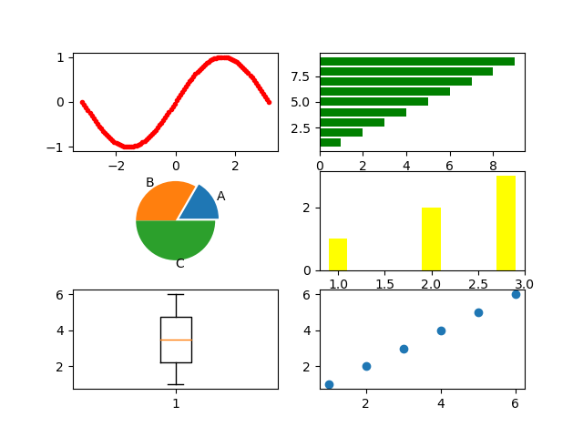

## 一、段落控制

### 1.列表

* 无序列表
  
  + 无序列表
    
    - 无序列表
1. 有序列表
   
   1. 有序列表
      
      1. 有序列表

### 2.图片



### 3.代码段

```python
print('Hello World')
```

```c
#include<stdio.h>
int main(){
    printf("Hello World");
    return 0;
}
```

## 二、数学公式

### 1.希腊字母

$\alpha$ $\beta$ $\gamma$ $\mu$ $\sigma$ $\delta$ $\epsilon$ $\eta$ $\theta$ $\zeta$ $\lambda$ $\tau$ $\phi$ $\rho$ $\omega$ 

$\nabla$ $\Delta$ $\Omega$ $\Theta$

### 2.上标下标

$a^{2}$ $a_{1}$ $\hat{x}$

$\underset {a} {max}$

$\overline{a}$ $\widehat{a}$ $\widetilde{a}$ $\vec{a}$ $\dot{a}$ $\ddot{a}$

$\underline{a}$

### 3.计算符号

$x+y$

$x-y$

$x \pm y$

$x \mp y$

$x \times y$

$x \cdot y$

$x \div y$

$x \% y$

$\frac{x}{y}$

$a^{x}$

$\log_{a}(x)$

$\sqrt[n]{x}$

$\lfloor n/2 \rfloor$

$\lceil n/2 \rceil$

$\nabla$

$\partial$

### 4.等式符号

$x > y$

$x < y$

$x \geq y$

$x \leq y$

$x = y$

$x \neq y$

$x \approx y$

$x \equiv y$

### 5.集合符号

$x \in y$

$x \notin y$

$x \subset y$

$x \not\subset y$

$x \subseteq y$

$x \not\subseteq y$

$x \cup y$

$x \cap y$

$x \sim D$

$x \nsim D$

### 6.多项式符号

$x \to y$

$\infty$

$lim_{x \to y}$

$\prod_{1}^{n}x$

$\sum_{1}^{n} x$

$\underset{i}{\sum}$

$\int_{1}^{n}xdx$

$1,2,3, \cdots, n$

$x1+x2+x3+\cdots+x_{n}$

### 7.逻辑运算符号

$\because$ $\therefore$ $\forall$ $\exists$

### 8.矩阵

$$
\begin{matrix}
1 & 2 & 3 \\
4 & 5 & 6 \\
7 & 8 & 9 \\
\end{matrix}
$$

$$
\begin{pmatrix}
1 & 2 & 3 \\
4 & 5 & 6 \\
7 & 8 & 9 \\
\end{pmatrix}
$$

$$
\begin{bmatrix}
1 & 2 & 3 \\
4 & 5 & 6 \\
7 & 8 & 9 \\
\end{bmatrix}
$$

$$
\begin{Bmatrix}
1 & 2 & 3 \\
4 & 5 & 6 \\
7 & 8 & 9 \\
\end{Bmatrix}
$$

$$
\begin{vmatrix}
1 & 2 & 3 \\
4 & 5 & 6 \\
7 & 8 & 9 \\
\end{vmatrix}
$$

### 9.约束方程

$$
\begin{align*}
min & \ f(x) \\
s.t. 
& \ g_i(x) \le 0, i \in I \\
& \ h_i(x)=0, i \in E \\
\end{align*}
$$

### 10.多行公式

$$
\begin{align*}
f(x)=\left\{
\begin{align*}
& x+1 \\
& x^2 \\
& x-1
\end{align*}
\right.
\end{align*}
$$
